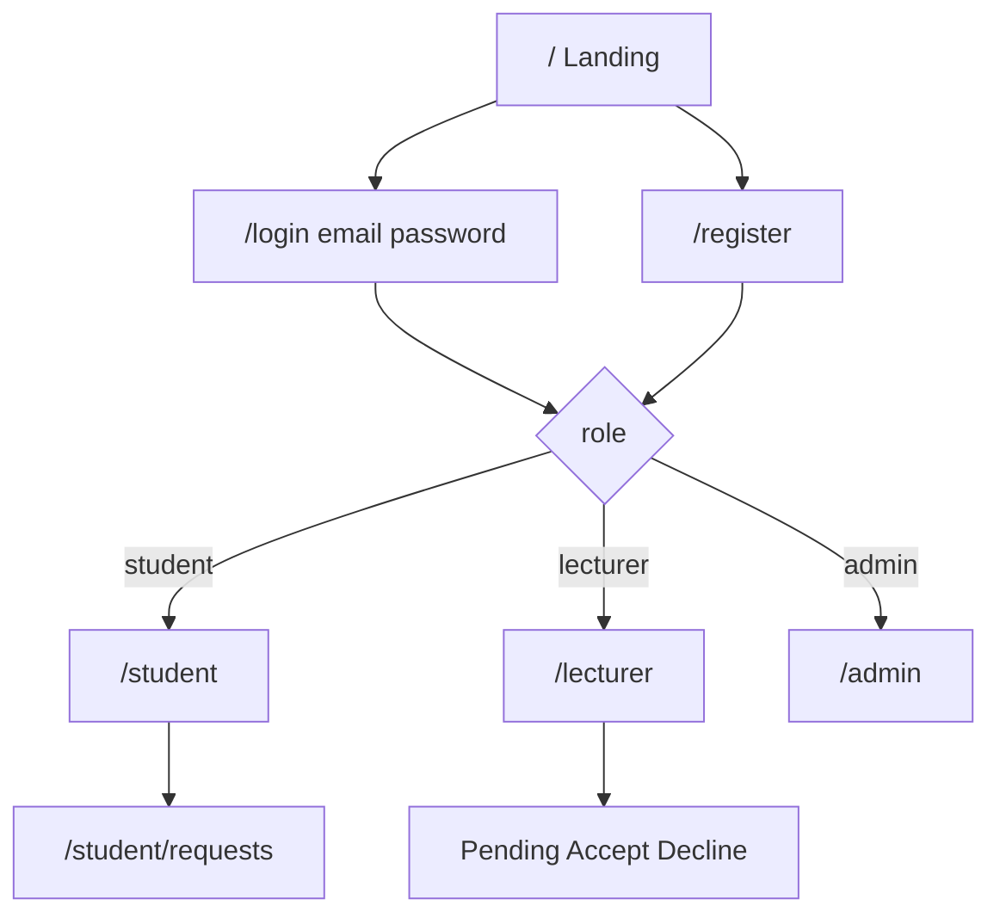

# UniBook Design Document

**Product:** UniBook - University Lecturer Appointment Booking System  
**Institution:** University of Ghana  
**Reading this as:** trust-first university service UI aligned with UG Sakai (LMS) visual language - navy chrome, slate section bars, flat white panels, utilitarian sans-serif.

**Visual reference:** University of Ghana Sakai portal (navy top bar, blue widget headers, white content, light gray page ground).

**Dials:** `DESIGN_VARIANCE: 2` · `MOTION_INTENSITY: 2` · `VISUAL_DENSITY: 5`

Companion docs: [`plan.md`](./plan.md) (architecture), SRS (requirements). Reference asset: Sakai screenshot in project assets.

---

## 1. Design goals

1. **Clarity over decoration** - a student should book in under a minute; a lecturer should clear pending requests without hunting.
2. **Role-obvious** - student and lecturer homes feel related but never confuse “request” with “approve.”
3. **Status at a glance** - Pending / Accepted / Declined are the primary visual language after login.
4. **Mobile-first usable** - NFR-01: same flows on phone and desktop; large tap targets for Accept/Decline.
5. **Familiar UG portal feel** - match Sakai’s navy / slate-blue / white academic chrome so UniBook feels native to campus tools students already use.

---

## 2. Brand and visual system

### 2.1 Name and hierarchy

- **UniBook** appears as white wordmark in the navy top bar (Sakai-style chrome), and larger on the public landing.
- Supporting line (one sentence): *Book consultation time with University of Ghana lecturers.*
- App chrome after login: solid navy header - brand left, breadcrumb or page context center/left, user + Sign out right (icons optional, keep sparse).

### 2.2 Color tokens (CSS variables) - Sakai-aligned

Extracted from the UG Sakai portal look:

| Token | Value | Use |
|-------|-------|-----|
| `--color-navy` | `#003366` | Top nav bar, primary buttons, brand chrome |
| `--color-navy-deep` | `#002147` | Optional darker edge / footer |
| `--color-section` | `#3D5A80` | Section / panel header bars (Sakai widget titles) |
| `--color-nav-active` | `#004080` | Active sidebar / nav item background |
| `--color-ink` | `#222222` | Primary body text |
| `--color-ink-muted` | `#5C6B7A` | Secondary text, meta, icons |
| `--color-link` | `#0B57A4` | Inline links |
| `--color-paper` | `#F4F6F8` | Page background behind panels |
| `--color-surface` | `#FFFFFF` | Panel / form / list backgrounds |
| `--color-line` | `#D0D7DE` | Borders, dividers, card edges |
| `--color-select` | `#E3F2FD` | Selected row / focus wash (calendar-style sky) |
| `--color-highlight` | `#FFF9C4` | Soft attention highlight (today / callout) |
| `--color-available` | `#1B7A4E` | “Accepting appointments” badge text/bg tint |
| `--color-unavailable` | `#6B7280` | “Unavailable” muted badge |
| `--color-pending` | `#8A6A1F` | Pending status |
| `--color-accepted` | `#1B7A4E` | Accepted status |
| `--color-declined` | `#C62828` | Declined status |
| `--color-danger` | `#C62828` | Decline action, errors, alerts |
| `--color-on-navy` | `#FFFFFF` | Text/icons on navy and section headers |

**Focus ring:** `2px solid #0B57A4` (link blue), optional outer wash `--color-select`.

Avoid: gold/terracotta accents, purple/indigo gradients, glassmorphism, heavy shadows, dark-mode-first shell, decorative serif display type.

### 2.3 Typography - Sakai-aligned

Sakai uses a compact utilitarian **sans-serif** stack. UniBook matches that (no display serif).

| Role | Family | Notes |
|------|--------|-------|
| UI / brand / body | **Open Sans** via `next/font` | Closest campus-portal feel; fallbacks: `Helvetica Neue`, `Arial`, `sans-serif` |
| Monospace (rare) | system mono | IDs only if needed |

| Style | Size / weight |
|-------|----------------|
| Top-bar brand | 1.125–1.25rem, semibold 600, white |
| Page title (in content) | 1.25–1.5rem, bold 700, `--color-ink` |
| Section header (on `--color-section`) | 0.875–1rem, bold 700, white |
| Body | 0.875–1rem (14–16px), regular 400, `--color-ink` |
| Meta / captions | 0.75–0.8125rem, `--color-ink-muted` |
| Buttons | 0.875rem, semibold 600 |

Tight academic spacing: line-height ~1.4–1.5 for body; section headers single-line with comfortable horizontal padding (12–16px).

### 2.4 Space and shape (portal panels)

- Base unit: 4px; content gutters 16–24px.
- Radius: `4px` on panels/inputs/buttons (Sakai-like, subtle).
- Borders: `1px solid var(--color-line)`; **prefer border over shadow**.
- Shadows: none or barely-there (`0 1px 2px rgba(0,0,0,.04)`).
- **Panel pattern (primary content unit):** white surface + full-width `--color-section` header bar + white body - same language as Sakai widgets (“Message Of The Day”, “Calendar”).
- Lists of lecturers/requests live inside these panels as divided rows (not marketing card grids).

### 2.5 Atmosphere (landing only)

- Landing may use a full-width `--color-navy` band with white UniBook wordmark + Sign in / Register CTAs, then drop into `--color-paper` with a single introductory panel.
- No purple mesh, no gold gradients, no floating badges on the hero.
- Keep the post-login app visually continuous with Sakai: navy header + paper background + section panels.

---

## 3. Information architecture

| Screen | Primary job | One headline |
|--------|-------------|--------------|
| Landing | Sign in / Register | UniBook + one line + Sign in + Register CTAs |
| Login | Authenticate | Email + password |
| Register | Create account | Name, UG email, password |
| Student home | Find available lecturer + request | “Available lecturers” |
| Student requests | Track outcomes | “Your requests” |
| Lecturer home | Broadcast availability + decide | “Consultation desk” |
| Admin | Health glance | “System overview” |

One job per section: no stats strips, promo chips, or secondary marketing blocks on first viewport of app screens.

---

## 4. Screen designs

### 4.1 Landing (`/`)

**First viewport (hero budget only):**
1. Brand: **UniBook** (large white wordmark over full-bleed campus photo + navy scrim)
2. One headline: consultation without the email chase
3. One supporting sentence: availability → request → clear decision for UG
4. One CTA group: **Get started** + **Sign in**
5. One dominant visual plane: edge-to-edge campus photography (no inset cards, no floating badges)

Transparent landing header over the hero. Below fold: How it works (numbered columns, not marketing cards), student/lecturer editorial split, navy closing CTA, deep-navy footer.

### 4.1b Login (`/login`) & Register (`/register`)

- Sakai-style white panel with `--color-section` header (“Sign in” / “Create account”).
- Fields: email, password; register also has name (+ confirm password).
- Any valid email accepted.
- Link between login ↔ register at the foot of the form.
- Primary button: navy **Sign in** / **Create account**.

### 4.2 Student - Available lecturers (`/student`)

- Page title + short helper: “Only lecturers currently accepting appointments are listed.”
- **List (not card grid):** name, optional department/email snippet, green “Available” pill.
- Row action: **Request appointment** → expands or navigates to inline form:
  - Date, time, reason (textarea)
  - Submit → success toast / redirect to requests
- Empty state: calm copy - “No lecturers are accepting appointments right now.”
- Collision (409): inline error - “That time slot is already requested. Choose another time.”

### 4.3 Student - Requests (`/student/requests`)

- Chronological list (upcoming first).
- Each row: lecturer name · datetime · reason excerpt · **status badge** (Pending / Accepted / Declined).
- No Accept/Decline controls (read-only).
- Soft note: “Refresh to see updates” (no WebSockets).

### 4.4 Lecturer - Consultation desk (`/lecturer`)

**Section A - Master switch (FR-02)** - panel with section header “Availability”  
- Large segmented control or toggle: **Accepting appointments** vs **Unavailable**.  
- Status color binds to `--color-available` / `--color-unavailable`.  
- Helper text explains students only see you when Accepting.

**Section B - Pending requests (FR-05)** - panel with section header “Pending requests”  
- Dense but readable rows: student name/email · proposed time · reason.  
- Actions: primary **Accept** (navy button) · secondary **Decline** (outline/danger).  
- Confirm decline with lightweight confirm (“Decline this request?”) to prevent mis-taps.  
- Empty: “No pending requests.”

Accepted/declined history can be a secondary panel if time allows; MVP may show pending-only.

### 4.5 Admin (`/admin`)

- Minimal: counts (users, appointments by status) + recent activity table.  
- No heavy analytics chrome.

---

## 5. Components

| Component | Behavior |
|-----------|----------|
| `AppHeader` | Navy bar: UniBook wordmark, nav links, user/sign-out |
| `Panel` | White box + `--color-section` title bar + body (Sakai widget) |
| `StatusBadge` | pending / accepted / declined / available / unavailable |
| `AvailabilityToggle` | Lecturer master switch; optimistic UI + rollback on error |
| `LecturerRow` | Name + Available + Request CTA |
| `RequestForm` | date, time, reason; client validation then Server Action |
| `PendingRequestRow` | Accept / Decline with loading disabled state |
| `EmptyState` | Title + one sentence; no illustration clutter |
| `Alert` | Error/success inline under forms |

**Buttons:** solid `--color-navy` primary (white label); outline secondary; danger outline for Decline. Min height 44px on mobile.

**Forms:** label above field; blue focus ring; errors under field in `--color-danger`.

---

## 6. Status and feedback language

| Event | UI feedback |
|-------|-------------|
| Request submitted | Toast + row appears as Pending on requests page |
| Slot collision | Form-level error; keep field values |
| Accept / Decline | Row leaves pending queue; optional brief success toast |
| Email send fail after save | Toast: “Status updated; email could not be sent.” |
| Unauthorized role | Redirect to correct home; no flash of wrong dashboard |

Copy voice: plain academic English, short sentences, no emoji, no slang.

---

## 7. Motion (restrained)

Ship 2–3 intentional motions only:

1. Landing: brand + CTA fade/slide-up once on load (~300ms).  
2. Status badges: soft color fade on change.  
3. Pending row: exit fade when Accept/Decline succeeds.

No infinite loops, parallax, or glow pulses. Respect `prefers-reduced-motion`.

---

## 8. Responsive layout

| Breakpoint | Behavior |
|------------|----------|
| &lt; 640px | Single column; sticky bottom bar optional for lecturer Accept/Decline on open detail |
| ≥ 640px | Nav horizontal; lists full width with actions right-aligned |
| ≥ 960px | Content max-width ~720–800px centered (forms/lists); landing can go wider for hero |

Touch: Accept/Decline not adjacent to accidental targets; 8px+ gap.

---

## 9. Accessibility

- Contrast ≥ WCAG AA for text on paper/navy/white.
- Toggle and buttons keyboard-reachable; visible focus (blue ring + select wash).
- Status not by color alone - include text label on every badge.
- Form labels associated with inputs; errors linked via `aria-describedby`.
- Sign-in button has clear accessible name.

---

## 10. Email (notification design)

- From: UniBook / configured `EMAIL_FROM`
- Subject: `Appointment Accepted - {Lecturer}` or `Appointment Declined - {Lecturer}`
- Body: plain HTML; navy header strip with white “UniBook”; body ink on white; lecturer name, date/time, status.
- Matches Sakai-adjacent tone; mobile-readable single column; no heavy images.

---

## 11. Implementation notes (for build)

- Tokens in CSS variables on `:root`; Tailwind theme maps `navy`, `section`, `paper`, etc.
- Font: `next/font/google` → **Open Sans** only (weights 400, 600, 700).
- Shared chrome: `src/components/AppHeader.tsx` + `Panel.tsx`; role layouts under `src/app/student` and `src/app/lecturer`.
- Prefer Server Components for lists; client islands only for toggle, forms, and toasts.

---

## 12. Out of design scope (MVP)

- Dark mode theme switcher  
- Calendar month grid / drag-drop scheduling  
- Real-time live updating without refresh  
- Marketing illustration sets, icon grids, stat strips on dashboards  
- Custom logo lockup beyond wordmark typography  

---

## 13. Design acceptance checklist

- [ ] Looks familiar next to UG Sakai: navy header, slate section bars, white panels, light gray page  
- [ ] Open Sans (or equivalent) everywhere - no display serif  
- [ ] Landing first viewport: brand + one headline + one sentence + Sign in/Register CTAs + navy visual plane  
- [ ] Student can find Available lecturers and submit date/time/reason on phone  
- [ ] Lecturer master switch is unmistakable  
- [ ] Pending Accept/Decline usable with thumb on mobile  
- [ ] Status badges readable without relying on color alone  
- [ ] No gold accents, purple gradients, glassmorphism, or marketing card-grid hero  
- [ ] Responsive at 375px and 1280px without horizontal scroll  
 
