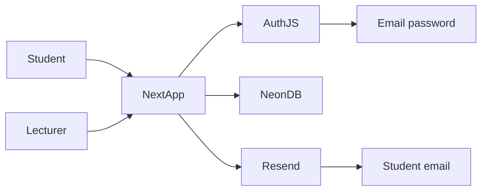
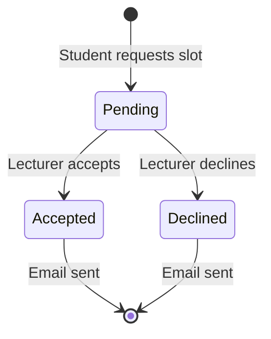

# UniBook 48-Hour MVP (Vercel Path)

**Project:** UniBook - University Lecturer Appointment Booking System (University of Ghana)

**Overview:** Greenfield 48-hour MVP on Vercel: Next.js App Router, Neon Postgres + Drizzle, Auth.js email/password sign-in (domain-restricted), Resend emails, covering FR-01–FR-07 with lecturer/student dashboards and collision-safe booking.

## Locked decisions

| Choice | Decision |
|--------|----------|
| Scope | Full MVP: scaffold → auth → booking → dashboards → email → live deploy |
| Framework | Next.js (App Router) + TypeScript + Tailwind CSS |
| Hosting | Vercel |
| Database | Neon Postgres via `@neondatabase/serverless` + Drizzle ORM |
| Auth | Auth.js v5 **Credentials** (email + password); **no Google OAuth**; any email allowed |
| Email | Resend (sync send on Accept/Decline - NFR-02 technical debt accepted) |
| Domain | No email domain restriction |
| Roles | `LECTURER_EMAILS` / `ADMIN_EMAILS` on register; default = `student` |
| Exam artifacts | [`plan.md`](./plan.md) (architecture), [`design.md`](./design.md) (UI/UX) |

**SRS note (FR-01):** Original SRS specified Google SSO + university domain lock. This MVP uses **email/password with any email** - simpler for demos and local testing.

Out of scope (per SRS): Google Calendar sync, async job queues, `.ics` attachments, WebSockets. Also out: Google OAuth / SSO.

## Architecture





## Data model (Drizzle → Neon)

**`users`**
- `id` (uuid PK), `email` (unique), `name`
- `passwordHash` (text) - bcrypt; never store plain passwords
- `role`: `student` | `lecturer` | `admin`
- `availabilityStatus`: `available` | `unavailable` (lecturers only; default `unavailable`)
- `createdAt`

**`appointments`**
- `id` (uuid PK)
- `studentId` → users
- `lecturerId` → users
- `startsAt` (timestamptz)
- `reason` (text)
- `status`: `pending` | `accepted` | `declined`
- `createdAt`, `updatedAt`
- **FR-04:** unique index on `(lecturerId, startsAt)` so the DB rejects duplicate slots; API maps unique violation → friendly 409

## App routes and features

| Route | Who | Maps to |
|-------|-----|---------|
| `/` | Public | Landing + CTAs to Sign in / Register |
| `/login` | Public | Email + password form |
| `/register` | Public | Name, email, password |
| `/student` | Student | List available lecturers; request form (date, time, reason) - FR-03 |
| `/student/requests` | Student | History: Pending / Accepted / Declined - FR-06 |
| `/lecturer` | Lecturer | Global Available/Unavailable toggle - FR-02; pending queue with Accept/Decline - FR-05 |
| `/admin` | Admin | Read-only health: user counts, recent appointments (minimal SRS admin) |

Mutations via **Server Actions**:
- `registerUser` / credentials `authorize` for login
- `toggleAvailability`
- `createAppointmentRequest` (assert lecturer is `available`; catch unique constraint)
- `respondToAppointment(id, 'accepted' | 'declined')` - **NFR-03:** verify session user is the appointment’s lecturer (or admin)
- After accept/decline: `await resend.emails.send(...)` to student (FR-07 / NFR-02)

Auth gate: middleware protects `/student`, `/lecturer`, `/admin`; role mismatch redirects to the correct home.

## Auth (FR-01 adapted / NFR-03)

- Auth.js Credentials provider: email + password against `users.passwordHash` (bcrypt)
- **Register:** any valid email; hash password; assign `role` from `LECTURER_EMAILS` / `ADMIN_EMAILS`
- **Login:** verify password; session JWT includes `user.id` + `role`
- Sign out via Auth.js `signOut`
- No Google client ID/secret; no domain allowlist

## Email (FR-07)

- Resend template (simple HTML): lecturer name, slot time, Accepted/Declined
- Sync in the same Server Action as status update; surface UI error if email fails after DB update (log + toast; booking state still saved)

## UI approach (NFR-01)

- Visual system mirrors UG Sakai: navy `#003366` header, slate section bars, white panels, `#F4F6F8` page ground, **Open Sans**
- Details in [`design.md`](./design.md)
- Responsive single layout: navy top bar (brand, role home, sign out)
- No calendar widgets beyond date/time inputs; refresh to see new requests (no WebSockets)

## Repo layout

```
plan.md
README.md
.env.example
drizzle.config.ts
src/
  app/                  # routes above
  components/
  db/schema.ts
  db/index.ts
  lib/auth.ts
  lib/email.ts
  lib/roles.ts
  lib/password.ts
  middleware.ts
```

## Environment variables

- `DATABASE_URL` - Neon
- `AUTH_SECRET` - session encryption (generate with `openssl rand -base64 32`)
- `LECTURER_EMAILS=...` `ADMIN_EMAILS=...`
- `RESEND_API_KEY`, `EMAIL_FROM`
- `AUTH_URL` / `NEXT_PUBLIC_APP_URL` - production URL after deploy

No `AUTH_GOOGLE_ID` / `AUTH_GOOGLE_SECRET`. No `ALLOWED_EMAIL_DOMAINS`.

## 48-hour execution order

1. **Scaffold + git** - `create-next-app`, Tailwind, Drizzle, Auth.js, bcrypt, Resend; `README.md` + `.env.example`
2. **Neon** - create project, schema + migration (`passwordHash`), wire `db`
3. **Auth** - register + login (Credentials), domain + role checks, middleware
4. **Lecturer** - availability toggle + pending Accept/Decline + authz
5. **Student** - available lecturers list + request form + requests dashboard + unique-slot handling
6. **Email** - Resend on status change
7. **Polish** - responsive UI, empty states, error messages for 409 collisions
8. **Deploy** - Vercel project link, env vars, smoke-test live URL

## Implementation todos

1. Scaffold Next.js + Tailwind + Drizzle + Auth.js + Resend; README + `.env.example`
2. Provision Neon, migrate users/appointments schema, email/password auth with domain + role allowlists
3. Lecturer availability toggle + pending Accept/Decline with role checks
4. Student available-lecturer list, booking request, status dashboard, unique-slot 409 handling
5. Resend notifications on Accept/Decline; deploy to Vercel with env vars

## Success checklist (SRS)

- FR-01 Login (**email/password**, any email; not Google SSO / domain lock - intentional)
- FR-02 Lecturer availability master switch
- FR-03 Student browse + request
- FR-04 DB unique constraint on lecturer+slot
- FR-05 Lecturer Accept/Decline
- FR-06 Student status history
- FR-07 Email on Accept/Decline
- NFR-01 Responsive
- NFR-03 Lecturer-only approval endpoints
- NFR-04 Live on Vercel within window
